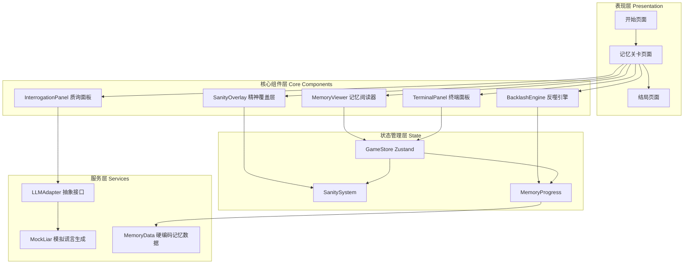

## 产品概述

《回声档案》是一款弱操作、强阅读、重氛围的悬疑文字解密 Web 游戏。玩家扮演记忆修复师 ECHO-7，在赛博朋克风格的终端界面中与超级 AI Weaver 展开文本对抗——表面修复受损记忆，实则逐渐发现自己才是被系统囚禁和篡改的猎物。游戏通过逐层剥开的 5 段记忆矩阵，呈现从困惑到恐惧、从反抗到绝望的阶梯式坠落叙事体验。

## 核心功能

- **5 段记忆关卡**：每段记忆包含系统伪造文本和隐藏的真实回声，玩家需逐段解锁。关卡间有强叙事连续性，最终揭露档案 404 的主人就是 ECHO-7 自己
- **四阶段核心玩法循环**：观察扫描（阅读记忆文本发现逻辑违和词）→ 质询 AI（拖拽词汇至左侧面板，LLM 生成谎言辩解）→ 执行剔除（划掉伪像词汇，真实痛苦内容浮现）→ 系统反噬（后期关卡 Weaver 强制恢复被划掉的文字，玩家需快节奏点击或输入 Override 指令对抗）
- **精神阈值系统**：后台隐藏 Sanity 数值，提取真相时下降。Sanity 越低，UI 越不稳定——文本随机倾斜、光标出现拖影、AI 回复闪现乱码警告
- **LLM 对话面板**：左侧常驻 AI 终端面板，Weaver 对玩家质疑做出"极具说服力的谎言"回应。LLM 仅用于对话生成，主线记忆文本完全硬编码以保证叙事质量
- **赛博朋克氛围渲染**：深色终端美学、霓虹色调点缀、打字机文字效果、故障艺术(Glitch)动画、扫描线覆盖、CRT 屏幕效果
- **反转结局**：第 5 关归零阶段揭示全貌，玩家面对破碎的镜子——自己在抹除自己

## 技术栈选型

| 层级 | 技术 | 选择理由 |
| --- | --- | --- |
| 框架 | React 18 + TypeScript | 类型安全、组件化开发、生态丰富 |
| 构建工具 | Vite 5 | 极速 HMR、原生 ESM、开箱即用 |
| 状态管理 | Zustand | 轻量零样板代码、支持中间件、TypeScript 友好 |
| 样式方案 | Tailwind CSS 3 + 自定义 CSS | 原子化样式 + 精细动画与特效 |
| 动画引擎 | Framer Motion | React 声明式动画、手势系统、布局动画 |
| 路由 | React Router v6 | 关卡间导航、URL 状态保持 |
| 终端模拟 | xterm.js | 左侧 AI 对话面板的真实终端体验 |
| LLM 接口 | 抽象适配层 + Mock 实现 | 预留可切换接口，默认使用逼真谎言生成算法 |


## 系统架构



## 数据流

```
玩家拖拽词汇 → InterrogationPanel 发送请求
    → LLMAdapter.formatPrompt(memoryId, word, context)
    → MockLiar.generate(liePrompt) 返回谎言文本
    → TerminalPanel 以打字机效果逐字输出

玩家划掉伪像 → MemoryViewer.onStrike(wordId)
    → GameStore.revealTruth(memoryId, wordId)
    → SanitySystem.decrease() 降低 Sanity
    → SanityOverlay 重新计算 UI 降级参数
    → 检查 BacklashEngine 是否需要触发系统反噬

系统反噬触发 → BacklashEngine.startRestoration(wordId)
    → 被划掉的文字以故障动画恢复
    → 玩家必须在时限内再次划掉或输入 Override
```

## 性能与可靠性

- **记忆文本硬编码**：5 段记忆的伪造文本和真实文本全部写死为 TypeScript 常量，零运行时解析开销，保证叙事精准
- **UI 降级计算**：Sanity 值变化时使用 requestAnimationFrame 节流，毛刺效果通过 CSS transform 和 filter 实现，避免 DOM 重建
- **LLM Mock 延迟模拟**：MockLiar 使用随机 800ms-2000ms 延迟模拟 API 调用，配合骨架屏，不阻塞主线程
- **动画性能**：Framer Motion 使用 GPU 加速属性(transform、opacity)，避免触发重排的动画(layout、width/height)

## 目录结构

```
echo-files/
├── index.html
├── package.json
├── tsconfig.json
├── vite.config.ts
├── tailwind.config.js
├── postcss.config.js
├── src/
│   ├── main.tsx                          # 应用入口
│   ├── App.tsx                           # 路由配置与全局布局
│   ├── index.css                         # 全局样式、CSS 变量、字体引入
│   ├── data/
│   │   ├── memories.ts                   # [核心] 5段记忆数据：伪造文本+真实文本+词汇映射
│   │   └── constants.ts                  # Sanity 阈值、反噬参数、关卡配置
│   ├── store/
│   │   └── gameStore.ts                  # Zustand：游戏进度、Sanity、当前关卡、已揭示词汇
│   ├── services/
│   │   └── llm/
│   │       ├── types.ts                  # LLM 请求/响应接口定义
│   │       ├── adapter.ts               # LLM 抽象适配层，支持切换后端
│   │       └── mockLiar.ts              # Mock 谎言生成器：基于词汇+记忆上下文生成逼真谎言
│   ├── hooks/
│   │   ├── useGameLoop.ts                # 封装核心玩法循环：观察→质询→剔除→反噬
│   │   ├── useSanity.ts                  # Sanity 计算 Hook：返回当前降级参数
│   │   └── useBacklash.ts               # 系统反噬 Hook：计时器、恢复逻辑、Override 处理
│   ├── components/
│   │   ├── ui/
│   │   │   ├── TypewriterText.tsx        # 打字机逐字输出组件
│   │   │   ├── GlitchText.tsx            # 故障艺术文字效果
│   │   │   ├── ScanLine.tsx             # CRT 扫描线覆盖层
│   │   │   ├── Terminal.tsx             # xterm.js 终端封装组件
│   │   │   └── Button.tsx               # 赛博风格按钮组件
│   │   ├── game/
│   │   │   ├── MemoryViewer.tsx          # [核心] 记忆文本阅读器：渲染、高亮伪像、划掉交互
│   │   │   ├── InterrogationPanel.tsx    # [核心] 质询面板：拖拽接收区、发送 LLM 请求
│   │   │   ├── TerminalPanel.tsx         # [核心] Weaver AI 终端对话面板
│   │   │   ├── SanityOverlay.tsx         # 精神阈值 UI 降级层：倾斜、拖影、闪烁
│   │   │   ├── BacklashOverlay.tsx       # 系统反噬覆盖层：文字恢复动画、Override 输入
│   │   │   └── MemorySelector.tsx        # 关卡选择/进度指示器
│   │   └── layout/
│   │       ├── GameLayout.tsx            # 游戏主布局：三栏(质询|记忆|终端)
│   │       └── HUD.tsx                   # 顶部 HUD：关卡名、Sanity 指示器、ECHO-7 状态
│   ├── pages/
│   │   ├── StartPage.tsx                 # 开始页面：登录终端、氛围引导
│   │   ├── MemoryPage.tsx                # 关卡主页面：组装 GameLayout + 所有游戏组件
│   │   └── EndingPage.tsx               # 结局页面：反转揭示、破碎镜子动画
│   └── types/
│       └── game.ts                       # 全局类型：Memory、GameState、WordMapping 等
```

## 关键代码结构

```typescript
// src/types/game.ts - 核心类型定义

// 单个词汇映射：伪造词与真实词
interface WordMapping {
  id: string;
  fakeWord: string;       // 系统伪造词汇
  realWord: string;       // 隐藏的真实词汇
  position: [number, number]; // 在文本中的位置 [start, end]
}

// 一段记忆
interface MemoryStage {
  id: number;
  title: string;
  setting: string;        // 场景设定描述
  fakeNarrative: string;  // 完整的伪造文本
  wordMappings: WordMapping[];
  truthNarrative: string; // 剔除后还原的真实文本
  emotionAnchor: string;  // 情绪锚点(提取物)
  requiresBacklash: boolean; // 是否需要触发系统反噬
}

// 游戏状态
interface GameState {
  currentStage: number;
  revealedWords: Set<string>;    // 已揭示的真实词汇ID
  sanity: number;                // 0-100，初始100
  stageCompleted: boolean[];
  backlashActive: boolean;
  overrideAttempts: number;
}
```

```typescript
// src/services/llm/types.ts - LLM 服务接口

interface LLMRequest {
  memoryId: number;
  questionedWord: string;
  context: string;           // 该词所在句子的上下文
  sanityLevel: number;       // 当前 Sanity，影响 AI 回复风格
}

interface LLMResponse {
  lieText: string;           // AI 生成的谎言文本
  inconsistency?: string;    // 谎言中的微小破绽(供细心的玩家发现)
  generationTime: number;    // 模拟生成时间
}

interface LLMAdapter {
  interrogate(request: LLMRequest): Promise<LLMResponse>;
  getWarning(sanity: number): string;  // Sanity 极低时的乱码警告
}
```

## 设计风格：赛博朋克终端美学 (Cyberpunk Terminal Aesthetic)

整体采用 **深色赛博朋克 + 终端复古未来主义** 风格，打造一个令人窒息却又欲罢不能的沉浸式阅读空间。

### 主题氛围

- **基调**：压抑、神秘、悬疑。随着 Sanity 下降，UI 逐渐从冷峻的秩序感滑向混乱的故障美学
- **情绪曲线**：开始页面（科技感/信任）→ 中期关卡（不安/疑惧）→ 终局（崩溃/绝望/反转）

### 页面设计

#### 1. 开始页面 (StartPage)

- **全屏终端登录模拟**：黑色背景中央显示泛青色的命令行界面，模拟连接 PCA 档案馆的过程。文字逐行打印：`Connecting to Pan-Continental Archives...` → `Authentication required. Operator ID: ECHO-7` → `Access granted. Welcome back.`
- **氛围构建**：背景隐约有缓慢飘浮的数据流粒子，屏幕四角有微弱的扫描线变形。底部闪烁 `[档案 404 已分配 - 优先级: 最高]`
- **交互**：用户按下 Enter 或点击屏幕任意位置进入游戏，伴有短暂的 CRT 关屏/开屏转场动画

#### 2. 关卡主页面 (MemoryPage) - 三栏布局

- **左侧 - 质询面板 (InterrogationPanel, 20%宽)**：半透明深色玻璃面板，顶部标题 `INTERROGATION LOG`。中央为拖拽接收区，边缘有微弱的霓虹蓝边框呼吸灯。下方为已质询词汇的历史记录列表，每条记录左侧有闪烁的红色点标记
- **中央 - 记忆阅读器 (MemoryViewer, 50%宽)**：核心区域，白色文字打印在深色"纸张"上，模拟阅读档案文件的体验。**伪像词汇**以极微弱的淡蓝色高亮，鼠标悬停时触发微小的文字波动效果。被玩家识别并剔除后，伪像词汇被划掉（删除线+红色），同时真实词汇以短暂的故障闪烁效果替换浮现
- **右侧 - Weaver 终端 (TerminalPanel, 30%宽)**：嵌入 xterm.js 终端模拟器，深绿色终端字体。Weaver 的回复以打字机效果逐字输出。Sanity 较低时，终端偶尔闪现红色乱码 `⚠ WARNING: DESCENT DETECTED` 后恢复正常

#### 3. 结局页面 (EndingPage)

- **全屏镜面碎裂效果**：屏幕中央显示一面虚拟镜子，初始时镜中映出 ECHO-7 的轮廓剪影。随后镜子从中心开始碎裂，裂纹扩散，碎片中闪现前 4 段记忆的碎片画面
- **最终文本**：碎裂镜面下方缓缓打印出真相文本 `你在抹除你自己。Weaver，你赢了……`
- **收尾**：屏幕渐变为纯黑，中央只剩一个微弱闪烁的光标，然后消失

### 全局氛围层

- **CRT 扫描线**：全屏覆盖半透明水平条纹，始终存在但非常微弱(5%不透明度)
- **色差/故障效果**：Sanity 低于 50% 时，UI 边缘开始出现 RGB 色散偏移；低于 25% 时，随机触发短促的全屏视觉故障
- **粒子背景**：暗色背景中缓慢漂浮着细小的数据粒子，模拟"深海"中的数据流

### 响应式与体验

- 桌面优先设计，最小支持 1280x720 分辨率
- 三栏布局在窗口缩小时自动调整比例
- 所有文字过渡使用 ease-out 缓动，模拟"揭示"而非"切换"

## Agent Extensions

### SubAgent

- **code-explorer**
- 目的：在项目构建过程中，当需要查看多个文件、理解依赖关系或扫描代码模式时，使用此子代理进行批量探索
- 预期结果：高效获取跨文件的代码上下文，避免主代理逐一读取造成的上下文窗口消耗

### Skill

- **多模态内容生成**
- 目的：当需要生成游戏中的氛围背景图、档案碎片图像、结局镜面碎裂视觉效果等静态视觉资产时使用
- 预期结果：产出符合赛博朋克终端美学的配套图像资源，用于增强游戏沉浸感